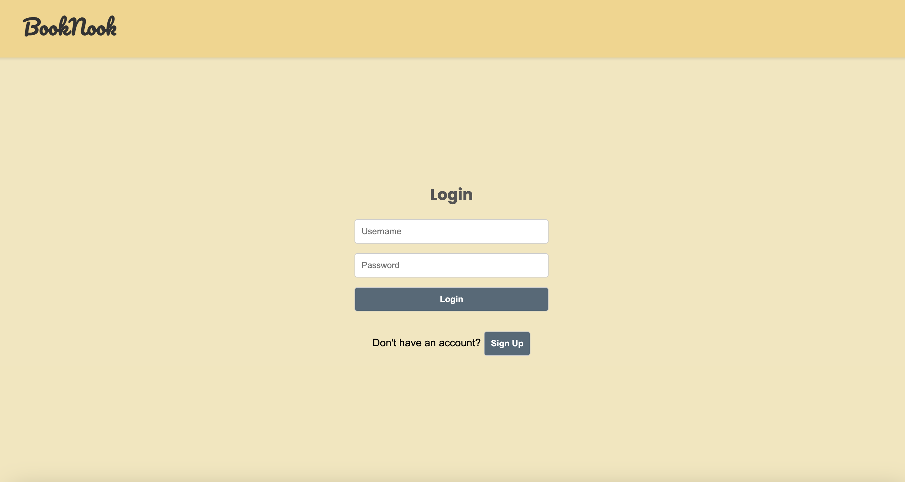
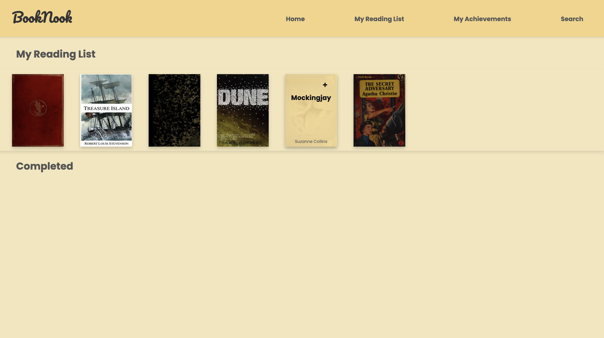

# BookNook

**BookNook** is a simple and elegant app that allows users to add books to their reading lists. It features a clean design and intuitive interface for managing your reading journey.

> **Note**: The app is still a work in progress.

---

## Features

- **Add Books to Reading List**: Quickly add new books to your list and track what you're currently reading.
- **Modern Design**: Thoughtfully crafted UI that is both minimal and visually appealing. 

### Screenshots

1. **Log In:**
   

2. **Homepage:**
   

3. **Reading List:**
   

---

## Areas for Improvement

Though BookNook works as intended, here are some planned upgrades:

- 🏆 **Achievements & Goals:** Set reading goals and celebrate your accomplishments.
- 📖 **Completed List:** Organize your finished books into a separate list.
- 🤖 **AI-Driven Recommendations:** Receive book suggestions tailored to your preferences.
- 🛠 **Enhanced Reading List:** Addressing minor bugs to ensure smoother functionality.

---

## Contributing

Feel free to submit pull requests or issues. All contributions are welcome!

